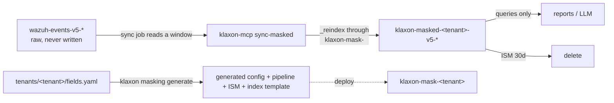

# Option B: a separate, masked data stream

The response-layer masker (`anonymization.py`) is the safety net that keeps
personal data out of the LLM's view. Option B moves masking **to the ingest
side**: a periodic sync job reindexes a recent time window from the raw Wazuh
stream through a generated ingest pipeline into a **separate** masked stream.
Reports and LLM queries run against that masked stream, where the data is
already tokenised — masking happens once, at write time, instead of per query.

Hard constraints, enforced in code:

* The raw streams `wazuh-events-v5-*` and `wazuh-findings-v5-*` are **never
  written to**. The sync job only reads them (`_reindex` with a range query).
* Every new resource is namespaced `klaxon-*`: pipeline
  `klaxon-mask-<tenant>`, ISM policy `klaxon-masked-retention-<tenant>`, index
  template `klaxon-masked-<tenant>`, data stream `klaxon-masked-<tenant>-v5-*`,
  checkpoint index `klaxon-sync-state`.
* Masking is **deterministic**: the same raw value always produces the same
  token, so aggregations over the masked stream still count distinct entities
  correctly.
* `related.hash` is **never** masked. File hashes are security IOCs, not
  personal data; the loader refuses it outright if listed.



## Single source of truth: `fields.yaml`

`tenants/<tenant>/fields.yaml` is where the masking field list lives **exactly
once**. `klaxon masking generate` (the **single** generator) builds four
artifacts from it:

* `tenants/<tenant>/generated/klaxon-config.yaml` — the Klaxon config fragment
  (`anonymization.mask_fields`, `masked_streams`, `mask_free_text_users`,
  `mask_free_text_fields`, `gdpr_checker.custom_patterns`). Merge it into the
  server config.
* `tenants/<tenant>/generated/pipeline-klaxon-mask-<tenant>.json` — the ingest
  pipeline **template** (`PUT /_ingest/pipeline/klaxon-mask-<tenant>`). The
  salt lives in the script processor's `params.salt`; the committed file
  carries a `__SALT__` placeholder so the secret never enters version control.
* `tenants/<tenant>/generated/ism-klaxon-masked-retention-<tenant>.json` — the
  ISM retention policy (`PUT /_plugins/_ism/policies/klaxon-masked-retention-
  <tenant>`): hot (rollover) -> delete after `--retention-days` (default 30).
* `tenants/<tenant>/generated/index-template-klaxon-masked-<tenant>.json` — the
  index template (`PUT /_index_template/klaxon-masked-<tenant>`):
  `index_patterns: [klaxon-masked-<tenant>-v5-*]`, priority 200,
  `data_stream: {}`, `index.default_pipeline` + `index.lifecycle.name`. The
  offline generator omits `mappings`; `apply-masked-infra` fetches them from
  the Wazuh stream at deploy time.

Regenerate after editing `fields.yaml`:

```console
klaxon masking generate --tenant customer-a
```

### The generator (`klaxon masking generate`)

* Default (no `--out`/`--stdout`) writes the **committed** artifact set above
  (pipeline template with `params.salt = "__SALT__"`) into
  `tenants/<tenant>/generated/`. This is the form CI drift-checks.
* `--out DIR` (or `--stdout` / `--out -`) writes the **deployable** artifact
  set with the **real salt** in `params.salt` — the form an operator PUTs to
  the indexer. The generator never writes to the indexer itself; deploying is
  the operator's/CI's job.
* `--check` writes nothing: it compares the committed artifacts against
  `fields.yaml` and exits non-zero on drift.
* `--retention-days N` sets the ISM delete-after (default 30).
* `--salt` / `--salt-env` override the salt and its environment variable.

**Mandatory self-test.** Every `generate` run first proves the generated
Painless token scheme is **byte-identical** to `derive_token(value, family,
salt)` for a fixed set of representative values per family. On ANY mismatch the
command aborts and emits NO artifacts — changing the token scheme in
`derive_token` breaks generation, not the deployed pipeline. Run it standalone
for CI:

```console
klaxon masking selftest                 # token scheme only
klaxon masking selftest --tenant X     # also validates X's rendered script
```

**Deploy-time salt check.** The salt is read from the SAME environment variable
as the response layer (`KLAXON_ANONYMIZATION_SALT`, or `salt_env` from
`fields.yaml`). If it is unset, `generate` uses a random salt and emits a
WARNING: tokens change if the salt is not stable, so previously written masked
documents stop correlating. `klaxon masking salt-check --tenant X` compares the
salt baked into the DEPLOYED pipeline (`params.salt`, via
`GET /_ingest/pipeline/klaxon-mask-<tenant>`) with the current env salt and
fails on a mismatch (tokens would no longer be deterministic across deploys).

Drift between the committed artifacts and `fields.yaml` is caught by CI
(`.github/workflows/verify-masking-config.yml`, which also runs
`klaxon masking selftest`), the pre-commit hook (`.pre-commit-config.yaml`),
and the `klaxon-mcp verify-config --tenant X` command. All run the same
`--check` comparison.

## The pipeline

`klaxon-mask-<tenant>` is a Painless script processor. It copies `_source`,
masks the structured fields from the table (arrays element-wise, missing fields
no-op, already-tokenised values passed through unchanged), then runs a
free-text pass over `message` and any other `free_text_fields`:

1. Known identities first — a raw username from a structured `USER` field is
   replaced wherever it appears in free text, **reusing the exact structured
   token** (the registry reads the raw document, not the already-masked map).
2. Value types: e-mails and IP addresses anywhere.
3. Username context patterns (`user=...`, `Accepted publickey for ...`,
   `uid=...` with a leading letter, `... (uid=N)`, bare `user <name>`).
4. When `mask_free_text_users: false`, steps 1 and 3's broader patterns are
   skipped; e-mails, IPs and the two basic `user`-noun/auth forms still mask.

A masking failure never drops a document: the `on_failure` processor sets
`klaxon.masking_error` and the **unmodified raw** document is still indexed so
the failure is visible.

### Token scheme (pipeline) vs (response layer)

The pipeline produces tokens as `SHA-256(family + ":" + value + ":" + salt)`
truncated to 16 hex characters, displayed as `[FAMILY_<16 hex>]`. The response
layer uses HMAC-SHA256 with the same display shape. The two are **not** the
same token for the same value — but that is inert: masked-stream values are
already tokens, and the response layer's idempotent passthrough (`[FAMILY_<16
hex>]` is never re-masked) leaves them byte-identical. What matters is that
**within one stream** the tokens are deterministic and family-scoped.

## Deploying and running

```console
# 1. generate the artifacts (or use the committed ones); selftest runs first
klaxon masking generate --tenant customer-a

# 2. deploy pipeline (real salt in params.salt), ISM, index template, data stream
klaxon-mcp apply-masked-infra --tenant customer-a --retention-days 30
#    (or PUT the deployable set from `klaxon masking generate --out DIR`)

# 3. merge generated/klaxon-config.yaml into the Klaxon config so the response
#    layer passes masked-stream tokens through

# 4. first sync (no checkpoint -> 24h lookback)
klaxon-mcp sync-masked --tenant customer-a

# 5. schedule the sync (e.g. cron/kubernetes CronJob every 5-15 minutes)
klaxon-mcp sync-masked --tenant customer-a --overlap-hours 1
```

`sync-masked` **preflights** before every run and refuses to sync when the
deployed pipeline's fingerprint or field list no longer matches `fields.yaml`,
or when the effective Klaxon config masks different fields — a stale pipeline
would silently write unmasked data. Run `klaxon-mcp verify-config --tenant X`
to audit all drift sources at once.

### The live integration test (`klaxon masking test`)

Before deploying, prove the generated pipeline actually compiles and masks
correctly on the real indexer — without writing anything:

```console
# credentials: KLAXON_INDEXER_URL / KLAXON_INDEXER_USER / KLAXON_INDEXER_PASSWORD
# (or a gitignored local tests/live/.env / .env.live file — see tests/live/.env.example)
klaxon masking test --tenant customer-a
```

Two stages, both write-free:

* **Stage A — ingest allowlist preflight:** `GET /_scripts/painless/_context`
  (`context=ingest`) verifies the cluster's ingest Painless allowlist has every
  API the generated script needs (`String.sha256()`, `Pattern`/`Matcher`,
  `StringBuilder`, collections). `_execute` cannot compile an ingest script —
  its `painless_test` context lacks the ingest-only `sha256` augmentation — so
  Stage B's `_simulate` is the authoritative compile check.
* **Stage B — pipeline simulate:** `POST /_ingest/pipeline/_simulate` with the
  generated pipeline **inline** (nothing is deployed or persisted; `_meta` is
  stripped because the endpoint rejects it). This compiles the script in the
  ingest context AND asserts the masking: no `klaxon.masking_error`; `user.name`
  and `uid=<same-username>` in `message` share one token; `user.effective.name`
  like `root(uid=0)` masked; `related.user`/`related.hosts` arrays element-wise;
  `event.original` → one token; `related.hash` untouched; already-tokenised
  values unchanged.

Credentials are read ONLY from `KLAXON_INDEXER_URL` / `KLAXON_INDEXER_USER` /
`KLAXON_INDEXER_PASSWORD`. If any is unset the test **skips cleanly** (never
fails the suite) and the password is never logged. The same assertions run as
the pytest marked `integration`/`live` (`tests/test_live_masking.py`). For a
self-signed lab cluster, set `KLAXON_INDEXER_VERIFY_SSL=false` (default `true`;
the test warns) or — better — trust the cluster CA (`SSL_CERT_FILE`/system
trust store).

### The checkpoint and the window

The sync job stores a checkpoint (`@timestamp` of the last successful run) in
`klaxon-sync-state`. Each run re-scans `[checkpoint - overlap_hours, now]` with
`op_type: create` and `conflicts: proceed`, so:

* no document is duplicated (create-conflicts are skipped, not failures);
* no window is lost (a failed run does **not** advance the checkpoint — the
  window is retried next run);
* late-arriving documents within `overlap_hours` (default 1) are caught.

Documents arriving **after** the overlap window are permanently missed. This is
an accepted trade-off of the stream design — the sync cadence and overlap
should be chosen so the overlap comfortably exceeds the event pipeline's
worst-case delivery lag.

### `klaxon.masking_error` — filter it

Every consumer of the masked stream must filter on `NOT exists
klaxon.masking_error`, because a failed mask leaves the **raw** document
flagged in the stream. The sync job and `verify-config` surface the count.

## Retention

The ISM policy `klaxon-masked-retention-<tenant>` keeps the masked stream in
`hot` (rollover at `50gb` or `1d`) then deletes after `retention_days`
(default 30). The raw stream keeps its own, longer Wazuh retention.

Change retention and redeploy:

```console
klaxon-mcp apply-masked-infra --tenant customer-a --retention-days 14
```

The index template (`priority` 200) and ISM template (`priority` 100) match only
`klaxon-masked-<tenant>-v5-*`; Wazuh streams are untouched.

## Pointing reports at the masked stream

`masked_streams` (env `KLAXON_ANONYMIZATION_MASKED_STREAMS`, or the generated
config fragment) lists the masked stream patterns. The response layer treats
those streams' values as already masked and passes tokens through unchanged.
Reports and LLM tool calls should query `klaxon-masked-<tenant>-v5-*` instead
of `wazuh-events-v5-*`.

Klaxon does **not** block queries against the raw stream — blocking the raw
stream is an operator responsibility, via RBAC (deny read on `wazuh-events-v5-*`
to report/LLM consumers) and/or an allowlist. This is by design: Klaxon proxies
queries; it does not police them.

## Adding a tenant

```console
mkdir -p tenants/<tenant>
# write tenants/<tenant>/fields.yaml (copy customer-a's as a template)
klaxon masking generate --tenant <tenant>   # runs the mandatory self-test
klaxon masking salt-check --tenant <tenant> # verify the deployed salt matches the env
klaxon-mcp apply-masked-infra --tenant <tenant>
klaxon-mcp sync-masked --tenant <tenant>
```

## Security notes

* **The salt lives in the cluster.** Ingest pipelines cannot read process
  environment at index time, so the salt from `KLAXON_ANONYMIZATION_SALT` is
  baked into the **deployed** pipeline as the script processor's `params.salt`
  when you deploy the `--out`/`--stdout` artifacts or run `apply-masked-infra`.
  It is visible to anyone allowed `GET /_ingest/pipeline`. Restrict that
  permission to administrators; report/LLM consumers must not have it. The
  committed pipeline *template* carries `params.salt = "__SALT__"`, so the
  secret never enters git. `klaxon masking salt-check` compares the deployed
  salt with the current env salt at deploy time.
* **`verify-config` needs the indexer.** The drift audit compares the deployed
  pipeline too, so it cannot run without cluster access; the
  `klaxon masking generate --check` artifact comparison can.
* **Version bumps force regeneration.** The pipeline `_meta.generator_version`
  is part of the committed artifacts, so bumping the package version without
  re-running `klaxon masking generate` shows up as drift in CI/pre-commit.
* **Painless whitelist.** The script uses ONLY whitelisted APIs — the
  ingest-context `String.sha256()` augmentation (SHA-256, byte-identical to
  `MessageDigest`), regex literals for `Pattern`s (`Pattern.compile` is not
  whitelisted on restricted clusters), `Pattern`/`Matcher`/`StringBuilder` and
  the collections. `klaxon masking test` Stage A verifies the cluster's ingest
  allowlist has all of them before you deploy.
* **`script.painless.regex.limit-factor`.** The free-text pass applies regexes
  to whole log messages; on the default `limit-factor` (6), a long
  dot/digit-heavy line (e.g. many IPs, no e-mail) can trip the "Regular
  expression considered too many characters" guard and flag the document
  `klaxon.masking_error`. The value-type patterns use possessive quantifiers to
  keep the scan near-linear, but for long messages raise the setting (e.g. to
  20) in `opensearch.yml` on the indexer nodes. The live test detects this
  error and prints the exact remediation.

## What the tests pin

* `tests/test_generate_masking.py` — generator determinism (same YAML → same
  output), provenance fingerprints, pipeline structure (`params.salt`,
  on_failure present, no `related.hash`), config fragment ↔ fields.yaml
  agreement, the MANDATORY self-test (Painless reference == `derive_token`
  byte-for-byte; a deliberately changed scheme fails generation and emits no
  artifacts), the structural compile-safety check (functions before statements,
  no `ctx['_source']`, no dropped function/declaration), drift check, and the
  deploy-time salt helpers.
* `tests/test_sync_masked.py` — the Python twin of the Painless logic on
  representative log lines (LDAP DN, PAM, SSH publickey, arrays, missing
  fields, already-tokenised input, `mask_free_text_users: false`), plus the
  sync job's window/checkpoint/preflight safety with a fake indexer.
* `tests/test_live_masking.py` — **live** (marked `integration`/`live`,
  skipped without `KLAXON_INDEXER_*`): Stage A checks the ingest allowlist has
  the APIs the script needs; Stage B simulates the generated pipeline via
  `_simulate` (authoritative compile + behaviour) and asserts token identity
  for `uid=`, arrays element-wise, `event.original` single token,
  `related.hash` untouched, idempotency, and no `klaxon.masking_error`.
* `tests/test_live_test.py` — offline: credential resolution (env + gitignored
  dotenv, never logged), URL sanitisation, the ingest-allowlist preflight, and
  the Stage-B assertions validated against the Python twin.
* `tests/test_idempotent_masking.py` — already-tokenised values pass through
  `_source`, aggregation keys and composite `after_key`; no double-masking.
* `tests/test_config.py` — `masked_streams` env/YAML parsing and the
  fail-closed guard when env and YAML disagree on `mask_fields`.
