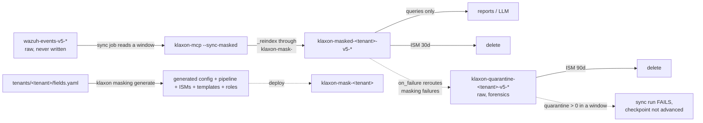

# Option B: a separate, masked data stream

> **Status: implemented & live-verified — NOT deployed.** The generator, the
> self-test and the live `klaxon masking test` all cover Option B, but no
> `klaxon-masked-<tenant>-v5-*` data stream exists on the indexer yet (0
> shards). Deploying is the operator's/CI's job — see
> [Deploying and running](#deploying-and-running).

The response-layer masker (`anonymization.py`) is the safety net that keeps
personal data out of the LLM's view. Option B moves masking **to the ingest
side**: a periodic sync job reindexes a recent time window from the raw Wazuh
stream through a generated ingest pipeline into a **separate** masked stream.
Reports and LLM queries run against that masked stream, where the data is
already tokenised — masking happens once, at write time, instead of per query.

Hard constraints, enforced in code:

* The raw streams `wazuh-events-v5-*` and `wazuh-findings-v5-*` are **never
  written to**. The sync job only reads them (`_reindex` with a range query).
* Every new resource is namespaced `klaxon-*`: pipeline
  `klaxon-mask-<tenant>`, ISM policies `klaxon-masked-retention-<tenant>` /
  `klaxon-quarantine-retention-<tenant>`, index templates
  `klaxon-masked-<tenant>` / `klaxon-quarantine-<tenant>`, data streams
  `klaxon-masked-<tenant>-v5` / `klaxon-quarantine-<tenant>-v5`, checkpoint
  index `klaxon-sync-state`.
* Masking is **deterministic**: the same raw value always produces the same
  token, so aggregations over the masked stream still count distinct entities
  correctly.
* A masking failure is **FAIL-CLOSED**: the failing document is rerouted to the
  **quarantine stream** `klaxon-quarantine-<tenant>-v5-*` (raw, forensically
  kept) — it never stays in the masked stream. See
  [Quarantine stream (fail-closed)](#quarantine-stream-fail-closed).
* `related.hash` is **never** masked. File hashes are security IOCs, not
  personal data; the loader refuses it outright if listed.



## Single source of truth: `fields.yaml`

`tenants/<tenant>/fields.yaml` is where the masking field list lives **exactly
once**. `klaxon masking generate` (the **single** generator) builds **seven**
artifacts from it:

* `tenants/<tenant>/generated/klaxon-config.yaml` — the Klaxon config fragment
  (`anonymization.mask_fields`, `masked_streams`, `mask_free_text_users`,
  `mask_free_text_fields`, `gdpr_checker.custom_patterns`). Merge it into the
  server config. `masked_streams` lists **only** `klaxon-masked-<tenant>-v5-*` —
  the quarantine stream is deliberately **never** added (see
  [Startup fail-closed check](#startup-fail-closed-check)).
* `tenants/<tenant>/generated/pipeline-klaxon-mask-<tenant>.json` — the ingest
  pipeline **template** (`PUT /_ingest/pipeline/klaxon-mask-<tenant>`). The
  salt lives in the script processor's `params.salt`; the committed file
  carries a `__SALT__` placeholder so the secret never enters version control.
  The committed template carries the provenance fingerprint as `_meta`; at
  deploy time that moves into the pipeline's `description` (OpenSearch rejects
  `_meta` in ingest pipelines), so the deployed pipeline is still drift-checked.
* `tenants/<tenant>/generated/ism-klaxon-masked-retention-<tenant>.json` — the
  masked stream's ISM retention policy (`PUT /_plugins/_ism/policies/
  klaxon-masked-retention-<tenant>`): hot (rollover) -> delete after
  `--retention-days` (default 30).
* `tenants/<tenant>/generated/index-template-klaxon-masked-<tenant>.json` — the
  index template (`PUT /_index_template/klaxon-masked-<tenant>`):
  `index_patterns: [klaxon-masked-<tenant>-v5*]` (must match the DATA STREAM
  NAME `...-v5` so OpenSearch can create it; also covers the `...-v5-000001`
  backing indices), priority 200, `data_stream: {}`, `index.default_pipeline`.
  Retention is attached the OpenSearch-native way — the ISM policy's
  `ism_template` (priority 100) matches the backing-index pattern
  `...-v5-*` (`index.lifecycle.name` is an Elasticsearch ILM setting OpenSearch
  rejects). The offline generator omits `mappings`; `--apply-masked-infra`
  fetches them from the Wazuh stream at deploy time.
* `tenants/<tenant>/generated/ism-klaxon-quarantine-retention-<tenant>.json` —
  the **quarantine** stream's ISM policy (same shape, **longer** retention:
  hot -> delete after **90 days** by default — the quarantine stream is
  forensics and must outlive the masked copies).
* `tenants/<tenant>/generated/index-template-klaxon-quarantine-<tenant>.json` —
  the **quarantine** index template:
  `index_patterns: [klaxon-quarantine-<tenant>-v5*]`, priority 200,
  `data_stream: {}`, and settings **without** `index.default_pipeline` —
  quarantine documents must never re-enter the masking pipeline.
* `tenants/<tenant>/generated/roles-<tenant>.yaml` — the OpenSearch
  security-plugin **roles fragment** (LLM/report, ops, sync service user) —
  see [Access control](#access-control).

Regenerate after editing `fields.yaml`:

```console
klaxon masking generate --tenant customer-a
```

### The generator (`klaxon masking generate`)

* Default (no `--out`/`--stdout`) writes the **committed** artifact set above
  (pipeline template with `params.salt = "__SALT__"`) into
  `tenants/<tenant>/generated/`. This is the form CI drift-checks.
* `--out DIR` (or `--stdout` / `--out -`) writes the **deployable** artifact
  set with the **real salt** in `params.salt` — the form an operator PUTs to
  the indexer. The generator never writes to the indexer itself; deploying is
  the operator's/CI's job.
* `--check` writes nothing: it compares the committed artifacts against
  `fields.yaml` and exits non-zero on drift.
* `--retention-days N` sets the masked-stream ISM delete-after (default 30);
  the quarantine ISM always uses `QUARANTINE_RETENTION_DAYS` (90).
* `--salt` / `--salt-env` override the salt and its environment variable.

**Mandatory self-test.** Every `generate` run first proves the generated
Painless token scheme is **byte-identical** to `derive_token(value, family,
salt)` for a fixed set of representative values per family, and that the
rendered script compiles the way the live test exercises it (functions before
statements, no `ctx['_source']`, and the fail-closed quarantine `on_failure`
routing is present). It also pins the **pure-Painless HMAC** (hand-rolled
SHA-256; `javax.crypto.Mac` is not in the ingest allowlist) against
authoritative vectors — RFC 4231 TC1–7, the key-length boundaries
64/65/63/0/1/32 bytes, UTF-8 umlaut/CJK/emoji, a `:`-containing value, empty
value/spaces, and the first-16-hex truncation — plus structural checks on the
rendered script (ipad/opad, two distinct SHA-256 steps, the `key.length > 64`
hash-first branch). On ANY mismatch the command aborts and emits NO artifacts —
changing the token scheme in `derive_token` breaks generation, not the deployed
pipeline. Run it standalone for CI:

```console
klaxon masking selftest                 # token scheme only
klaxon masking selftest --tenant X     # also validates X's rendered script
```

**Deploy-time salt check.** The salt is read from the SAME environment variable
as the response layer (`KLAXON_ANONYMIZATION_SALT`, or `salt_env` from
`fields.yaml`). If it is unset, `generate` uses a random salt and emits a
WARNING: tokens change if the salt is not stable, so previously written masked
documents stop correlating. `klaxon masking salt-check --tenant X` compares the
salt baked into the DEPLOYED pipeline (`params.salt`, via
`GET /_ingest/pipeline/klaxon-mask-<tenant>`) with the current env salt and
fails on a mismatch (tokens would no longer be deterministic across deploys).

Drift between the committed artifacts and `fields.yaml` is caught by CI
(`generate --check` in the masking workflow), the pre-commit hook
(`.pre-commit-config.yaml`), and the `klaxon-mcp --verify-config --tenant X`
command. All run the same `--check` comparison — now over all **seven**
artifacts, including the quarantine ISM/template and the roles fragment.

## The pipeline

`klaxon-mask-<tenant>` is a Painless script processor. It copies `_source`,
masks the structured fields from the table (arrays element-wise, missing fields
no-op, already-tokenised values passed through unchanged), then runs a
free-text pass over `message` and any other `free_text_fields`:

1. Known identities first — a raw username from a structured `USER` field is
   replaced wherever it appears in free text, **reusing the exact structured
   token** (the registry reads the raw document, not the already-masked map).
2. Value types: e-mails and IP addresses anywhere.
3. Username context patterns (`user=...`, `Accepted publickey for ...`,
   `uid=...` with a leading letter, `... (uid=N)`, bare `user <name>`).
4. When `mask_free_text_users: false`, steps 1 and 3's broader patterns are
   skipped; e-mails, IPs and the two basic `user`-noun/auth forms still mask.

### The `on_failure` block — FAIL-CLOSED (quarantine routing)

A masking failure is **never** left in the masked stream. The script processor
carries an `on_failure` block (two processors, verified against OpenSearch
3.6.0) that reroutes the failing document to the quarantine stream:

```painless
// 1. Preserve the original destination BEFORE rerouting (order matters).
ctx.klaxon.quarantine.original_index = ctx['_index'];
// 2. The failure reason: captured by a preceding `set` from
//    {{ _ingest.on_failure_message }} (the ONLY way OpenSearch exposes it to
//    on_failure — `_ingest` is not a script variable). Clusters that only log
//    the message yield an empty field -> fall back to 'unknown'.
if (!ctx['klaxon']['quarantine'].containsKey('reason')
    || ctx['klaxon']['quarantine']['reason'] == null
    || ctx['klaxon']['quarantine']['reason'].toString().isEmpty()) {
    ctx['klaxon']['quarantine']['reason'] = 'unknown';
}
// 3. Flag the document.
ctx.klaxon.masking_error = true;
// 4. Reroute into the quarantine stream (never re-enters masking).
ctx['_index'] = 'klaxon-quarantine-<tenant>-v5-raw';
```

Why two processors: on OpenSearch 3.x `_ingest.on_failure_message` is exposed
**only** through a `set`-processor value template (a Painless script gets
`cannot resolve symbol [_ingest.on_failure_message]`), so the message is
captured by a `set` and the rerouting happens in the script that follows. The
`set` carries `ignore_failure: true` and the script defaults an empty/missing
reason to `'unknown'` — that is the "handle both" fallback for clusters that
only log the failure message. The rerouted document lands in
`klaxon-quarantine-<tenant>-v5-raw` (auto-created as a data stream by the
quarantine index template), preserving `klaxon.quarantine.original_index`,
`klaxon.quarantine.reason`, `klaxon.masking_error` and the **raw** `_source`.
Because the quarantine template has no `index.default_pipeline`, the quarantined
document never passes through the masking pipeline again.

### Token scheme (pipeline) vs (response layer)

Both layers use the **same keyed construction**:
`HMAC-SHA256(key = salt, message = "<family>:<value>")` truncated to 16 hex
characters, displayed as `[FAMILY_<16 hex>]`. The pipeline implements it in pure
Painless (the ingest allowlist has no `javax.crypto.Mac`; a manual HMAC over an
`int[]` byte sequence is byte-identical to Python's `hmac` and proven by the
generator self-test + the live `_simulate`). For the same `value`/`family`/
`salt` both layers produce the **same** token — and a masked-stream value is
already a token, so the response layer's idempotent passthrough
(`[FAMILY_<16 hex>]` is never re-masked) leaves it byte-identical. What matters
is that **within one stream** the tokens are deterministic and family-scoped.
The salt is the HMAC key: keep it ≥ 256 bits, restrict who can read it, and do
**not** rotate on a schedule — see
[`docs/salt-rotation-runbook.md`](salt-rotation-runbook.md) and
[`docs/security-concept.md`](security-concept.md).

## Quarantine stream (fail-closed)

The quarantine stream `klaxon-quarantine-<tenant>-v5-*` holds documents whose
masking threw (raw, unmasked, with `klaxon.masking_error` and the quarantine
metadata). It is deliberately **not** named `klaxon-masked-*`, so it can never
overlap the LLM allowlist `klaxon-masked-<tenant>-v5-*` — an LLM query through
Klaxon can never read it. It exists to answer the forensic questions a masking
failure raises: *which document failed, why, and what was its original content?*

* **Purpose.** Visibility + forensics for masking failures. The raw document is
  preserved so an operator can inspect what personal data would have leaked
  and fix the pipeline / the source data.
* **Retention.** Longer than the masked stream (default **90 days**, constant
  `QUARANTINE_RETENTION_DAYS` in `masked_stream.py`, vs 30 for the masked
  stream) so a failure can be investigated after the masked copy is gone.
* **`on_failure` semantics.** Fail-closed: a masking-failure document is
  rerouted to `klaxon-quarantine-<tenant>-v5-raw` with
  `klaxon.quarantine.original_index` + `klaxon.quarantine.reason` +
  `klaxon.masking_error`. Nothing masking-failed ever stays in the masked
  stream (proven by the Stage-C `_simulate` test).
* **Access control.** See below — the LLM/report role has **no** read on the
  quarantine stream; only the ops role (and the sync service user, for writes)
  can touch it.
* **Alerting on quarantine > 0.** The sync job **fails** any run whose window
  produced a quarantine document: the checkpoint is NOT advanced and the run
  exits non-zero, so cron/CI alerting fires. See
  [The sync backstop](#the-sync-backstop-fail-closed).
* **The consumer-side filter is now defense-in-depth only.** Because
  masking-failure documents never stay in the masked stream, the old
  `NOT exists klaxon.masking_error` filter is no longer the guarantee — keep it
  for belt-and-braces (and for streams populated by a pre-quarantine pipeline),
  but the technical guarantee is the quarantine routing + the sync backstop.

### One-time migration of legacy `masking_error` documents

Before the fail-closed `on_failure` existed, masking-failure documents were
flagged `klaxon.masking_error` and **left in the masked stream**. If you have
such documents, migrate them into the quarantine stream **once**, as an
operator:

```console
klaxon masking migrate --tenant customer-a            # migrate + delete
klaxon masking migrate --tenant customer-a --dry-run  # show what would happen
```

The command finds `klaxon.masking_error` docs in `klaxon-masked-<tenant>-v5-*`,
reindexes them into `klaxon-quarantine-<tenant>-v5-raw` (`op_type: create`,
`conflicts: proceed`, **no masking pipeline** — quarantine never re-enters
masking), then deletes them from the masked stream (`_delete_by_query`) and
logs the count. It is **destructive** (deletes from the masked stream) and is
**never automated**; it is idempotent (a successful run leaves nothing flagged,
so re-running is a no-op). If the reindex reports failures, nothing is deleted.

## Startup fail-closed check

`masked_streams` (env `KLAXON_ANONYMIZATION_MASKED_STREAMS`, or the generated
config fragment) is the **LLM allowlist**: the response layer passes those
streams' values through unchanged, trusting them to be pre-masked. The
quarantine stream holds **raw** documents, so if any `masked_streams` pattern
could match `klaxon-quarantine-<tenant>-v5-*`, `Config.from_env()` raises
`ConfigError` and Klaxon **refuses to start/serve** (a hand-edit or env override
that adds a broad pattern like `klaxon-*` or a quarantine pattern is caught).
The generated config fragment never adds the quarantine stream to
`masked_streams` — **never add it by hand either**.

## Deploying and running

```console
# 1. generate the artifacts (or use the committed ones); selftest runs first
klaxon masking generate --tenant customer-a

# 2. deploy everything in one idempotent, ordered, self-verifying step:
#    pipeline, ISM policies, index templates, masked data stream, security
#    roles. Preflight aborts on drift / missing credentials / salt mismatch /
#    a running sync. Roles YAML -> JSON in code (no yq needed).
klaxon masking deploy --tenant customer-a --retention-days 30
klaxon masking deploy --tenant customer-a --dry-run   # plan only, no writes
klaxon masking deploy --tenant customer-a --rollback  # restore last snapshot

# 3. merge generated/klaxon-config.yaml into the Klaxon config so the response
#    layer passes masked-stream tokens through

# 4. first sync (no checkpoint -> 24h lookback)
klaxon-mcp --sync-masked --tenant customer-a

# 5. schedule the sync (e.g. cron/kubernetes CronJob every 5-15 minutes)
klaxon-mcp --sync-masked --tenant customer-a --overlap-hours 1
```

`klaxon masking deploy` reuses the drift check (it aborts naming any generated
artifact that differs from what `klaxon masking generate` would produce now),
the deployed-pipeline salt comparison (`params.salt` vs the env salt — a
mismatch aborts with a warning that stream and response-layer tokens would
diverge), and a running-sync heuristic (aborts unless `--force`; there is no
lock in the sync job, so a checkpoint written within the last 5 minutes is the
best-effort signal). Every PUT is followed by a GET-back fingerprint check, and
a final `_simulate` smoke test asserts `user.name` and a free-text `uid=` share
one token with no `klaxon.masking_error`. A snapshot of the previous deployed
state is kept under `tenants/<tenant>/generated/backup/<ts>/` (gitignored — it
embeds the real deployed salt) for `--rollback`; pipeline rollback is safe: no
data loss, the sync job can simply re-run. The running server stays
write-incapable — this is an explicit operator/CI CLI path.

`--sync-masked` **preflights** before every run and refuses to sync when the
deployed pipeline's fingerprint or field list no longer matches `fields.yaml`,
when the effective Klaxon config masks different fields, **or when the deployed
pipeline lacks the quarantine `on_failure` routing** — a stale/pre-quarantine
pipeline would silently write unmasked data and leave failures in the masked
stream. Run `klaxon-mcp --verify-config --tenant X` to audit all drift sources
at once.

### The live integration test (`klaxon masking test`)

Before deploying, prove the generated pipeline actually compiles and masks
correctly on the real indexer — without writing anything:

```console
# credentials: KLAXON_INDEXER_URL / KLAXON_INDEXER_USER / KLAXON_INDEXER_PASSWORD
# (or a gitignored local tests/live/.env / .env.live file — see tests/live/.env.example)
klaxon masking test --tenant customer-a
```

Three stages, all write-free:

* **Stage A — ingest allowlist preflight:** `GET /_scripts/painless/_context`
  (`context=ingest`) verifies the cluster's ingest Painless allowlist has every
  API the generated script needs (`String.sha256()`, `Pattern`/`Matcher`,
  `StringBuilder`, collections). `_execute` cannot compile an ingest script —
  its `painless_test` context lacks the ingest-only `sha256` augmentation — so
  Stage B's `_simulate` is the authoritative compile check.
* **Stage B — pipeline simulate:** `POST /_ingest/pipeline/_simulate` with the
  generated pipeline **inline** (nothing is deployed or persisted; `_meta` and
  `version` are stripped because the endpoint rejects them — the deployable
  pipeline embeds the same provenance in its `description`). This compiles the
  script in the ingest context AND asserts the masking: no
  `klaxon.masking_error`; `user.name`
  and `uid=<same-username>` in `message` share one token; `user.effective.name`
  like `root(uid=0)` masked; `related.user`/`related.hosts` arrays element-wise;
  `event.original` → one token; `related.hash` untouched; already-tokenised
  values unchanged.
* **Stage C — quarantine routing (fail-closed):** simulates a pipeline whose
  masking script is forced to throw (the REAL generated `on_failure` block is
  kept) and asserts the document is rerouted to
  `klaxon-quarantine-<tenant>-v5-raw` with `original_index` + `reason` +
  `masking_error` — and that no masking-failure document stays in the masked
  stream. A real masking failure on a correctly-configured cluster is rare and
  environment dependent, so the test exercises the `on_failure` block directly;
  this is the change that closes the fail-open gap.

Credentials are read ONLY from `KLAXON_INDEXER_URL` / `KLAXON_INDEXER_USER` /
`KLAXON_INDEXER_PASSWORD`. If any is unset the test **skips cleanly** (never
fails the suite) and the password is never logged. The same assertions run as
the pytest marked `integration`/`live` (`tests/test_live_masking.py`). For a
self-signed lab cluster, set `KLAXON_INDEXER_VERIFY_SSL=false` (default `true`;
the test warns) or — better — trust the cluster CA (`SSL_CERT_FILE`/system
trust store).

### The checkpoint and the window

The sync job stores a checkpoint (`@timestamp` of the last successful run) in
`klaxon-sync-state`. Each run re-scans `[checkpoint - overlap_hours, now]` with
`op_type: create` and `conflicts: proceed`, so:

* no document is duplicated (create-conflicts are skipped, not failures);
* no window is lost (a failed run does **not** advance the checkpoint — the
  window is retried next run);
* late-arriving documents within `overlap_hours` (default 1) are caught.

Documents arriving **after** the overlap window are permanently missed. This is
an accepted trade-off of the stream design — the sync cadence and overlap
should be chosen so the overlap comfortably exceeds the event pipeline's
worst-case delivery lag.

### The sync backstop (fail-closed)

After every reindex, the sync job counts the quarantine stream for the window
(`klaxon-quarantine-<tenant>-v5-*`, `@timestamp` in `[window_start, window_end]`):

* **quarantine count > 0** → the run **FAILS**: the checkpoint is NOT advanced,
  the window + count are logged to stderr, and the process exits non-zero (so a
  cron/CronJob alert fires). The window is re-scanned on the next run after the
  pipeline is fixed.
* **Optional reconcile** (catches silent drops — docs that neither made it into
  the masked stream nor were quarantined): set `KLAXON_SYNC_RECONCILE=true` to
  enable a `source(window) == masked(window) + quarantine(window)` count check;
  a mismatch logs a warning by default, and `KLAXON_SYNC_RECONCILE_FAIL=true`
  turns it into a failed run (checkpoint not advanced).
* The preflight (see above) refuses to sync on a deployed pipeline that lacks
  the quarantine `on_failure`.

### `klaxon.masking_error` — defense-in-depth filter

Because masking failures are rerouted to the quarantine stream, the masked
stream should never contain a `klaxon.masking_error` document. Keep the
consumer-side `NOT exists klaxon.masking_error` filter as **defense-in-depth**
(it costs nothing and protects streams populated by a pre-quarantine pipeline),
but the technical guarantee is now the quarantine routing + the sync backstop,
not the filter.

## Retention

* The ISM policy `klaxon-masked-retention-<tenant>` keeps the masked stream in
  `hot` (rollover at `50gb` or `1d`) then deletes after `retention_days`
  (default 30).
* The ISM policy `klaxon-quarantine-retention-<tenant>` keeps the quarantine
  stream in `hot` then deletes after **90 days** (forensics — longer than the
  masked stream).

The raw stream keeps its own, longer Wazuh retention. Change retention and
redeploy:

```console
klaxon-mcp --apply-masked-infra --tenant customer-a --retention-days 14
```

The index templates (`priority` 200) match `klaxon-masked-<tenant>-v5*` /
`klaxon-quarantine-<tenant>-v5*` (each data stream name plus its backing
indices); the ISM templates (`priority` 100) match the concrete backing-index
patterns `...-v5-*`. Wazuh streams are untouched.

## Access control

The roles fragment `tenants/<tenant>/generated/roles-<tenant>.yaml`
defines three OpenSearch security-plugin roles (apply via the security API or
merge into `roles.yml` — the operator's/CI's job; Klaxon never writes to the
cluster):

| Role | Reads | Notes |
|---|---|---|
| `klaxon_llm_report_<tenant>` | `klaxon-masked-<tenant>-v5-*` **only** | Can never read the quarantine stream or the raw stream. |
| `klaxon_ops_<tenant>` | `klaxon-quarantine-<tenant>-v5-*` + `wazuh-events-v5-*` | Forensics. No LLM mapping. |
| `klaxon_sync_<tenant>` | `wazuh-events-v5-*` (reindex source) | Writes the masked + quarantine streams + `crud` on `klaxon-sync-state`. |

The sync service user needs **write on the quarantine stream** for a concrete
reason: when the pipeline's `on_failure` reroutes `_index` to
`klaxon-quarantine-<tenant>-v5-raw`, the security plugin checks that write
permission. Without it the reroute is **rejected and the masking-failure
document is dropped entirely** — a useful fail-closed backstop (a failure
becomes a missing document + reindex failure, never a raw doc in the LLM
allowlist). Map the sync user to `klaxon_sync_<tenant>` **only**, never to the
LLM/report role.

## Pointing reports at the masked stream

`masked_streams` (env `KLAXON_ANONYMIZATION_MASKED_STREAMS`, or the generated
config fragment) lists the masked stream patterns. The response layer treats
those streams' values as already masked and passes tokens through unchanged.
Reports and LLM tool calls should query `klaxon-masked-<tenant>-v5-*` instead
of `wazuh-events-v5-*`. **Never** add `klaxon-quarantine-<tenant>-v5-*` to
`masked_streams` — Klaxon refuses to start if you do (fail-closed).

Klaxon does **not** block queries against the raw stream — blocking the raw
stream is an operator responsibility, via RBAC (deny read on `wazuh-events-v5-*`
to report/LLM consumers) and/or an allowlist. This is by design: Klaxon proxies
queries; it does not police them.

## Adding a tenant

```console
mkdir -p tenants/<tenant>
# write tenants/<tenant>/fields.yaml (copy customer-a's as a template)
klaxon masking generate --tenant <tenant>   # runs the mandatory self-test
klaxon masking salt-check --tenant <tenant> # verify the deployed salt matches the env
klaxon-mcp --apply-masked-infra --tenant <tenant>
# apply the generated roles fragment (LLM/ops/sync roles)
klaxon-mcp --sync-masked --tenant <tenant>
```

## Security notes

* **The salt lives in the cluster.** Ingest pipelines cannot read process
  environment at index time, so the salt from `KLAXON_ANONYMIZATION_SALT` is
  baked into the **deployed** pipeline as the script processor's `params.salt`
  when you deploy the `--out`/`--stdout` artifacts or run
  `--apply-masked-infra`. It is visible to anyone allowed
  `GET /_ingest/pipeline`. Restrict that permission to administrators;
  report/LLM consumers must not have it. The committed pipeline *template*
  carries `params.salt = "__SALT__"`, so the secret never enters git.
  `klaxon masking salt-check` compares the deployed salt with the current env
  salt at deploy time.
* **`verify-config` needs the indexer.** The drift audit compares the deployed
  pipeline too, so it cannot run without cluster access; the
  `klaxon masking generate --check` artifact comparison can.
* **Version bumps force regeneration.** `generator_version` is stamped into
  the committed artifacts' `_meta` (and, for the deployed pipeline, into its
  `description`), so bumping the package version without re-running
  `klaxon masking generate` shows up as drift in CI/pre-commit.
* **Painless whitelist.** The script uses ONLY whitelisted APIs — the
  ingest-context `String.sha256()` augmentation (SHA-256, byte-identical to
  `MessageDigest`), regex literals for `Pattern`s (`Pattern.compile` is not
  whitelisted on restricted clusters), `Pattern`/`Matcher`/`StringBuilder` and
  the collections. `klaxon masking test` Stage A verifies the cluster's ingest
  allowlist has all of them before you deploy.
* **`script.painless.regex.limit-factor`.** The free-text pass applies regexes
  to whole log messages; on the default `limit-factor` (6), a long
  dot/digit-heavy line (e.g. many IPs, no e-mail) can trip the "Regular
  expression considered too many characters" guard and flag the document
  `klaxon.masking_error` → it is rerouted to the **quarantine stream** (it no
  longer leaks into the masked stream, but it is also no longer masked, so
  treat a quarantine build-up as an alert). The value-type patterns use
  possessive quantifiers to keep the scan near-linear, but for long messages
  raise the setting (e.g. to 20) in `opensearch.yml` on the indexer nodes. The
  live test detects this error and prints the exact remediation.
* **Quarantine is raw.** `klaxon-quarantine-<tenant>-v5-*` contains unmasked
  personal data. RBAC: only the ops/security role (and the sync service user
  for writes) may access it; the LLM/report role has no read. Never add it to
  `masked_streams`. Quarantine documents never re-enter the masking pipeline
  (the quarantine index template sets no `index.default_pipeline`).

## What the tests pin

* `tests/test_generate_masking.py` — generator determinism (same YAML → same
  output), provenance fingerprints, pipeline structure (`params.salt`,
  FAIL-CLOSED on_failure present, no `related.hash`), the quarantine ISM
  (90d retention, own namespace) + quarantine index template (no
  `index.default_pipeline`) + roles fragment (LLM read-only on masked, ops read
  on quarantine + raw, sync write), config fragment ↔ fields.yaml agreement,
  the MANDATORY self-test (Painless reference == `derive_token` byte-for-byte;
  a changed scheme OR a fail-open on_failure fails generation and emits no
  artifacts), the structural compile-safety check, drift check over all seven
  artifacts, and the deploy-time salt helpers.
* `tests/test_sync_masked.py` — the Python twin of the Painless logic on
  representative log lines (LDAP DN, PAM, SSH publickey, arrays, missing
  fields, already-tokenised input, `mask_free_text_users: false`), plus the
  sync job's window/checkpoint/preflight safety with a fake indexer: the
  FAIL-CLOSED backstop (quarantine > 0 in a window → run fails, checkpoint not
  advanced), the optional reconcile (warn vs fail), the preflight abort on a
  pipeline lacking the quarantine on_failure, and the one-time migration
  command.
* `tests/test_live_masking.py` — **live** (marked `integration`/`live`,
  skipped without `KLAXON_INDEXER_*`): Stage A checks the ingest allowlist has
  the APIs the script needs; Stage B simulates the generated pipeline via
  `_simulate` (authoritative compile + behaviour); Stage C forces a masking
  failure and asserts the doc is rerouted to the quarantine stream with
  `original_index` + `reason` + `masking_error`.
* `tests/test_live_test.py` — offline: credential resolution (env + gitignored
  dotenv, never logged), URL sanitisation, the ingest-allowlist preflight, the
  Stage-B assertions validated against the Python twin, and the Stage-C
  quarantine-routing assertions.
* `tests/test_idempotent_masking.py` — already-tokenised values pass through
  `_source`, aggregation keys and composite `after_key`; no double-masking.
* `tests/test_config.py` — `masked_streams` env/YAML parsing, the fail-closed
  guard when env and YAML disagree on `mask_fields`, and the **startup
  fail-closed guard**: a `masked_streams` pattern that could match the
  quarantine stream raises `ConfigError` (quarantine is never added to
  `masked_streams`).
