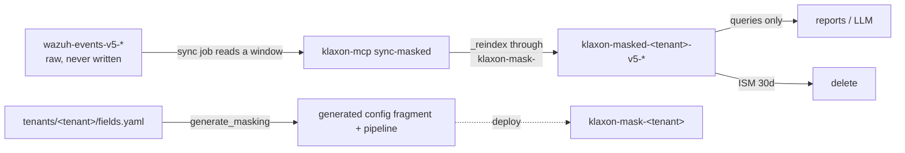

# Option B: a separate, masked data stream

The response-layer masker (`anonymization.py`) is the safety net that keeps
personal data out of the LLM's view. Option B moves masking **to the ingest
side**: a periodic sync job reindexes a recent time window from the raw Wazuh
stream through a generated ingest pipeline into a **separate** masked stream.
Reports and LLM queries run against that masked stream, where the data is
already tokenised — masking happens once, at write time, instead of per query.

Hard constraints, enforced in code:

* The raw streams `wazuh-events-v5-*` and `wazuh-findings-v5-*` are **never
  written to**. The sync job only reads them (`_reindex` with a range query).
* Every new resource is namespaced `klaxon-*`: pipeline
  `klaxon-mask-<tenant>`, ISM policy `klaxon-masked-retention-<tenant>`, index
  template `klaxon-masked-<tenant>`, data stream `klaxon-masked-<tenant>-v5-*`,
  checkpoint index `klaxon-sync-state`.
* Masking is **deterministic**: the same raw value always produces the same
  token, so aggregations over the masked stream still count distinct entities
  correctly.
* `related.hash` is **never** masked. File hashes are security IOCs, not
  personal data; the loader refuses it outright if listed.



## Single source of truth: `fields.yaml`

`tenants/<tenant>/fields.yaml` is where the masking field list lives **exactly
once**. Two artifacts are generated from it:

* `tenants/<tenant>/generated/klaxon-config.yaml` — the Klaxon config fragment
  (`anonymization.mask_fields`, `masked_streams`, `mask_free_text_users`,
  `mask_free_text_fields`, `gdpr_checker.custom_patterns`). Merge it into the
  server config.
* `tenants/<tenant>/generated/pipeline-klaxon-mask-<tenant>.json` — the ingest
  pipeline **template**, with a `__SALT__` placeholder (the secret never enters
  version control).

Regenerate after editing `fields.yaml`:

```console
python -m klaxon_mcp.generate_masking --tenant customer-a
```

Drift between the committed artifacts and `fields.yaml` is caught by CI
(`.github/workflows/verify-masking-config.yml`), the pre-commit hook
(`.pre-commit-config.yaml`), and the `klaxon-mcp verify-config --tenant X`
command. All three run the same `--check` comparison.

## The pipeline

`klaxon-mask-<tenant>` is a Painless script processor. It copies `_source`,
masks the structured fields from the table (arrays element-wise, missing fields
no-op, already-tokenised values passed through unchanged), then runs a
free-text pass over `message` and any other `free_text_fields`:

1. Known identities first — a raw username from a structured `USER` field is
   replaced wherever it appears in free text, **reusing the exact structured
   token** (the registry reads the raw document, not the already-masked map).
2. Value types: e-mails and IP addresses anywhere.
3. Username context patterns (`user=...`, `Accepted publickey for ...`,
   `uid=...` with a leading letter, `... (uid=N)`, bare `user <name>`).
4. When `mask_free_text_users: false`, steps 1 and 3's broader patterns are
   skipped; e-mails, IPs and the two basic `user`-noun/auth forms still mask.

A masking failure never drops a document: the `on_failure` processor sets
`klaxon.masking_error` and the **unmodified raw** document is still indexed so
the failure is visible.

### Token scheme (pipeline) vs (response layer)

The pipeline produces tokens as `SHA-256(family + ":" + value + ":" + salt)`
truncated to 16 hex characters, displayed as `[FAMILY_<16 hex>]`. The response
layer uses HMAC-SHA256 with the same display shape. The two are **not** the
same token for the same value — but that is inert: masked-stream values are
already tokens, and the response layer's idempotent passthrough (`[FAMILY_<16
hex>]` is never re-masked) leaves them byte-identical. What matters is that
**within one stream** the tokens are deterministic and family-scoped.

## Deploying and running

```console
# 1. generate the artifacts (or use the committed ones)
python -m klaxon_mcp.generate_masking --tenant customer-a

# 2. deploy pipeline (real salt), ISM policy, index template, data stream
klaxon-mcp apply-masked-infra --tenant customer-a --retention-days 30

# 3. merge generated/klaxon-config.yaml into the Klaxon config so the response
#    layer passes masked-stream tokens through

# 4. first sync (no checkpoint -> 24h lookback)
klaxon-mcp sync-masked --tenant customer-a

# 5. schedule the sync (e.g. cron/kubernetes CronJob every 5-15 minutes)
klaxon-mcp sync-masked --tenant customer-a --overlap-hours 1
```

`sync-masked` **preflights** before every run and refuses to sync when the
deployed pipeline's fingerprint or field list no longer matches `fields.yaml`,
or when the effective Klaxon config masks different fields — a stale pipeline
would silently write unmasked data. Run `klaxon-mcp verify-config --tenant X`
to audit all drift sources at once.

### The checkpoint and the window

The sync job stores a checkpoint (`@timestamp` of the last successful run) in
`klaxon-sync-state`. Each run re-scans `[checkpoint - overlap_hours, now]` with
`op_type: create` and `conflicts: proceed`, so:

* no document is duplicated (create-conflicts are skipped, not failures);
* no window is lost (a failed run does **not** advance the checkpoint — the
  window is retried next run);
* late-arriving documents within `overlap_hours` (default 1) are caught.

Documents arriving **after** the overlap window are permanently missed. This is
an accepted trade-off of the stream design — the sync cadence and overlap
should be chosen so the overlap comfortably exceeds the event pipeline's
worst-case delivery lag.

### `klaxon.masking_error` — filter it

Every consumer of the masked stream must filter on `NOT exists
klaxon.masking_error`, because a failed mask leaves the **raw** document
flagged in the stream. The sync job and `verify-config` surface the count.

## Retention

The ISM policy `klaxon-masked-retention-<tenant>` keeps the masked stream in
`hot` (rollover at `50gb` or `1d`) then deletes after `retention_days`
(default 30). The raw stream keeps its own, longer Wazuh retention.

Change retention and redeploy:

```console
klaxon-mcp apply-masked-infra --tenant customer-a --retention-days 14
```

The index template (`priority` 200) and ISM template (`priority` 100) match only
`klaxon-masked-<tenant>-v5-*`; Wazuh streams are untouched.

## Pointing reports at the masked stream

`masked_streams` (env `KLAXON_ANONYMIZATION_MASKED_STREAMS`, or the generated
config fragment) lists the masked stream patterns. The response layer treats
those streams' values as already masked and passes tokens through unchanged.
Reports and LLM tool calls should query `klaxon-masked-<tenant>-v5-*` instead
of `wazuh-events-v5-*`.

Klaxon does **not** block queries against the raw stream — blocking the raw
stream is an operator responsibility, via RBAC (deny read on `wazuh-events-v5-*`
to report/LLM consumers) and/or an allowlist. This is by design: Klaxon proxies
queries; it does not police them.

## Adding a tenant

```console
mkdir -p tenants/<tenant>
# write tenants/<tenant>/fields.yaml (copy customer-a's as a template)
python -m klaxon_mcp.generate_masking --tenant <tenant>
klaxon-mcp apply-masked-infra --tenant <tenant>
klaxon-mcp sync-masked --tenant <tenant>
```

## Security notes

* **The salt lives in the cluster.** Ingest pipelines cannot read process
  environment at index time, so the salt from `KLAXON_ANONYMIZATION_SALT` is
  baked into the **deployed** pipeline when you run `apply-masked-infra`. It is
  visible to anyone allowed `GET /_ingest/pipeline`. Restrict that permission
  to administrators; report/LLM consumers must not have it. The committed
  pipeline *template* carries `__SALT__`, so the secret never enters git.
* **`verify-config` needs the indexer.** The drift audit compares the deployed
  pipeline too, so it cannot run without cluster access; the `--generate-masking
  --check` artifact comparison can.
* **Painless whitelist.** The script uses `MessageDigest`/`Pattern`/`Matcher`
  and `StringBuilder`. Verify the cluster's `painless.whitelist` allows them on
  your OpenSearch version before first deploy.

## What the tests pin

* `tests/test_generate_masking.py` — generator determinism (same YAML → same
  output), provenance fingerprints, pipeline structure (on_failure present, no
  `related.hash`), config fragment ↔ fields.yaml agreement, CI drift check.
* `tests/test_sync_masked.py` — the Python twin of the Painless logic on
  representative log lines (LDAP DN, PAM, SSH publickey, arrays, missing
  fields, already-tokenised input, `mask_free_text_users: false`), plus the
  sync job's window/checkpoint/preflight safety with a fake indexer.
* `tests/test_idempotent_masking.py` — already-tokenised values pass through
  `_source`, aggregation keys and composite `after_key`; no double-masking.
* `tests/test_config.py` — `masked_streams` env/YAML parsing and the
  fail-closed guard when env and YAML disagree on `mask_fields`.
